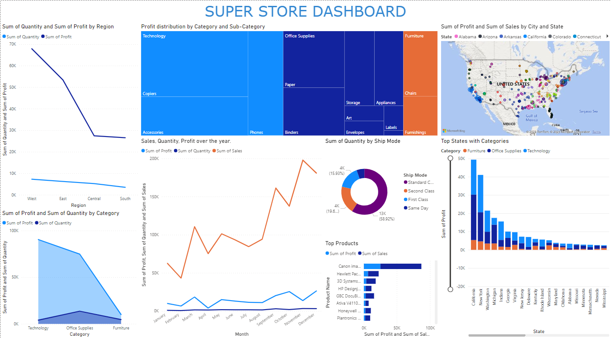

# Superstore Dashboard

## Overview

This repository contains a Power BI dashboard created using the Superstore dataset from Kaggle. The dashboard aims to provide insights into the market data, helping the store make informed decisions about product stocking, identifying top-selling categories and products, maximizing profits, and understanding sales distribution across different regions and categories.

## Dashboard Preview



## Files

- **Superstore Dataset**: The original dataset obtained from Kaggle. [Download Dataset](https://www.kaggle.com/datasets/addhyay/superstore-dataset)

- **Super_store_dashboard.pbix**: The Power BI dashboard file. Use this file to explore the visualizations and interact with the data.

## Key Insights

The dashboard comprises eight different graphs that focus on the following key aspects:

1. **Sales Distribution by Category and Region:** Visual representation of sales distribution across various product categories within different regions.

2. **Profit Analysis by Product and Category:** Identifying top-performing products and categories that contribute the most to overall profit.

3. **Top-Selling Products:** Highlighting the products with the highest sales volume.

4. **Shipping Mode Analysis:** Understanding the distribution of different shipping modes and their impact on sales.

5. **Profitable Regions:** Identifying regions that generate the most profit.

6. **Segment-wise Analysis:** Understanding customer segments and their contribution to sales and profit.

7. **Quantity vs. Profit:** Analyzing the relationship between the quantity of products sold and the resulting profit.

8. **Category-wise Profit Percentage:** Calculating the percentage of profit contributed by each product category.

## How to Use

1. Clone the repository to your local machine using the following command:
  
  ```bash
  git clone https://github.com/jashpaleja/Survival_Analysis-Employee_Attrition.git
  ```

3. Open the Power BI dashboard file (`Super_store_dashboard.pbix`) using Power BI Desktop.

4. Interact with the visualizations to explore the data and gain insights.

## Acknowledgments

- Superstore dataset by [Addhyay](https://www.kaggle.com/datasets/addhyay) on Kaggle.

